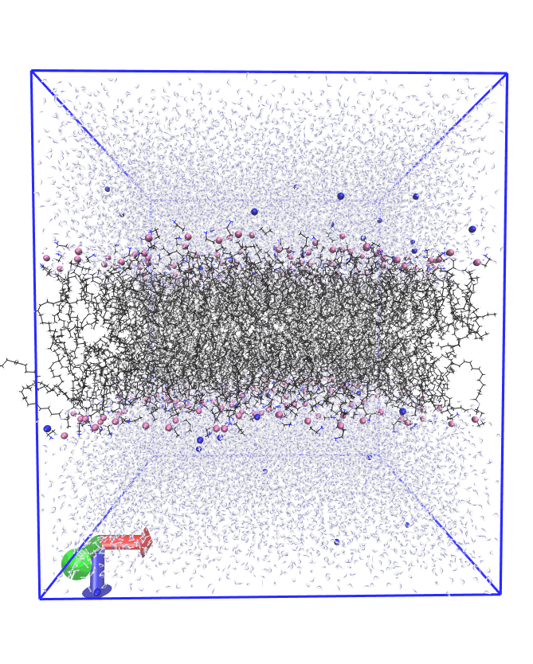

# membrane-sandwich-

**Movie 1**: A penta(arginine) undecyl-spaced methylenetriazyl methacrylate (R5uMA) in presence of a DOPE/DOPG 3/1 lipid bilayer. The trajectory covers 12.5 ns in the NPT (with a Berendsen barostat and a Beredenthermostat (ntt=1) at 300 K and 1 bar. Non-peptidic content is parametrised against gaff2, amino acids against ff14SB. The water model is the optimal point charge (OPC) scheme. K+ (not rendered) are added to neutralise the phosphate esters of DOPG and do not stay condensed to the membrane (physically correct behaviour). Cl- do not appear condensed to R5uMA.

The membrane moves considerably in z, as well as in the (x,y)-plane. This movement appears absent from trajectories generated from membrane-only simulations (Movie 2, the comparison is nevertheless partial, since the box dimensions are slightly smaller & the water model is TIP3P). Re-imaging using cpptraj manages to keep the membrane static, but movement of the anchoring lipids across the periodic boundaries inevitably causes jumps in the (x,y,z) (see Movie 3). A solution to these problems is perhaps not trivial (see Baptista et al. 10.1021/acs.jcim.2c00823). 

**Movie 2**: Bilayer-only trajectory (25 ns) in TIP3P water. Purple spheres are phosphatidylglyceryl moities (they are covalently bound to the lipids), red spheres are K+ ions.

**Movie 3**: R5uMA in a DOPE/DOPG 3/1 lipid bilayers, re-imaged using autoimage.
