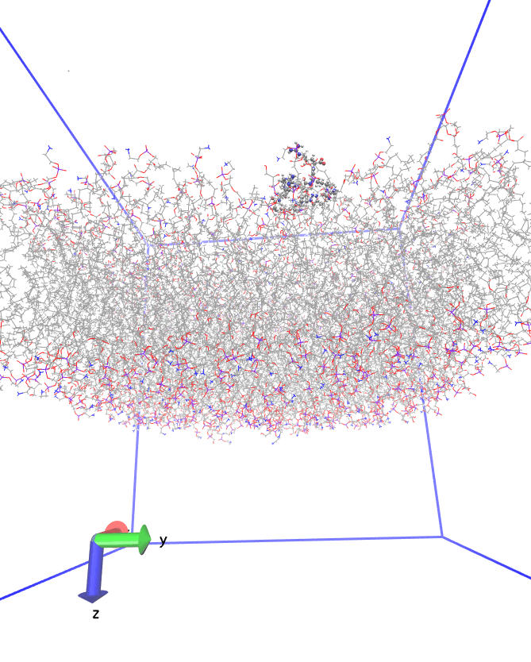

# membrane-sandwich-

Movie 1: A penta(arginine) undecyl-spaced methylenetriazyl methacrylate (R5uMA) in presence of a DOPE/DOPG 3/1 lipid bilayer. The trajectory covers 12.5 ns in the NPT (with a Berendsen barostat and a Beredenthermostat (ntt=1) at 300 K and 1 bar. Non-peptidic content is parametrised against gaff2, amino acids against ff14SB. The water model is the optimal point charge (OPC) scheme. Ions (not rendered) stay condensed to the membrane in the case of K+, which are added to neutralise the phosphate esters of DOPG. Cl- do not appear condensed to R5uMA.

The membrane moves considerably, which could be due to a transmembrane osmotic pressure gradient, or to insufficient optimisation in the pre-production phase (5x10000 cycles followed by heating in NVT, NPT, and then a 1 ns run in the NPT). Either way it is worthwhile to continue the simulation, re-center the membrane, and potentially demarcate a second production phase.
